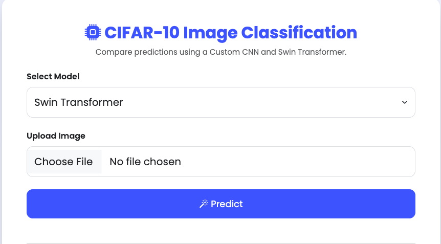
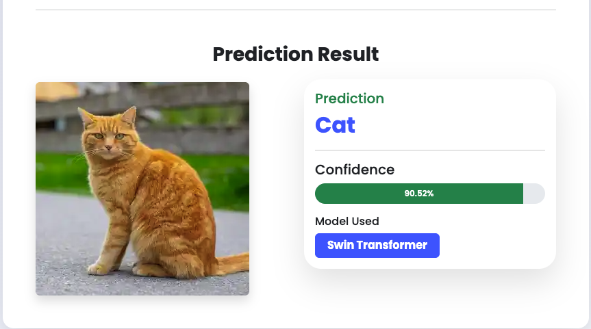

# CIFAR-10 Image Classification using Deep Learning

A Deep Learning web application for **CIFAR-10 Image Classification** using two different models:

- Custom CNN
- Swin Transformer (Swin-T) using feature extraction

The application is built with **PyTorch** and **Flask**, allowing users to upload an image and choose which model to use for prediction.

Web app link:

https://mdjuelrana-image-classification.hf.space/

---

## Features

- Custom CNN model
- Swin Transformer model
- Flask web application
- Modern Bootstrap UI
- Model selection dropdown
- Image upload and preview
- Confidence score visualization
- Responsive design

---

## Dataset

**CIFAR-10**

Classes:

| Label | Class |
|--------|--------|
| 0 | Airplane |
| 1 | Automobile |
| 2 | Bird |
| 3 | Cat |
| 4 | Deer |
| 5 | Dog |
| 6 | Frog |
| 7 | Horse |
| 8 | Ship |
| 9 | Truck |


Dataset Download:

https://www.kaggle.com/competitions/cifar-10/data?select=test.7z

---

# Project Structure

```
CIFAR10-Image-Classification/
│
├── app.py
├── predict.py
├── model_loader.py
├── class_names.py
├── requirements.txt
├── README.md
├── Dockerfile
├── .gitignore
│
├── models/
│   ├── cifar10_CNN_predictor.ipynb
│   ├── cifar10_swin.ipynb
│   ├── CNN.pth
│   └── swin_model.pth
│
├── templates/
│   └── index.html
│
├── static/
│   ├── css/
│   │   └── style.css
│   │
│   ├── js/
│   │   └── script.js
│   │
│   └── uploads/
│
└── Interface/
    ├── homepage.png
    └── prediction_result.png
```

---

# Requirements

- Python 3.12+
- uv
- Git

---

# Clone Repository

```bash
git clone https://github.com/juelrana0412/CIFAR10-Image-Classification.git

cd CIFAR10-Image-Classification
```

---

# Create Virtual Environment

Using **uv**

```bash
uv venv
```

Activate

### macOS / Linux

```bash
source .venv/bin/activate
```

### Windows

```cmd
.venv\Scripts\activate
```

---

# Install Dependencies

```bash
uv pip install -r requirements.txt
```

---

# Download Trained Models

Due to GitHub's **100 MB file limit**, the trained models are **not included** in this repository.

Download:

- [CNN.pth](https://drive.google.com/file/d/1okJeq47Za5tj4Vib8WTloX_jwFwumdE5/view?usp=sharing)
- [swin_model.pth](https://drive.google.com/file/d/1XhDsqjCIGLMW7wBaC3Jvv41G8XsyDBCm/view?usp=sharing)

Place them inside

```
models/
```

Result:

```
models/
├── CNN.pth
└── swin_model.pth
```

---

# Run the Application

```bash
python app.py
```

Open your browser

```
http://127.0.0.1:5000
```
---
# Docker Deployment

Build Docker image

```bash
docker build -t cifar10 .
```

Run

```bash
docker run -p 7860:7860 cifar10
```

---

# Hugging Face Deployment

1. Create a Docker Space
2. Upload project files
3. Upload model files
4. Wait for build
5. Open the generated URL

---
# Using the Web App

1. Select a model

- Custom CNN
- Swin Transformer

2. Upload an image

3. Click

```
Predict
```

The application will display

- Predicted Class
- Confidence Score
- Selected Model

---

# Application Screenshots

## Home Page

The home page allows users to select the desired deep learning model, upload an image, and perform image classification.

<p align="center">
  
</p>

---

## Prediction Result

After selecting a model and uploading an image, the application predicts the image class and displays the confidence score.

<p align="center">
  
</p>

---

# Training

Train the Custom CNN

```bash
python train_cnn.py
```

Train Swin Transformer

```bash
python train_swin.py
```

---

# Save Models

CNN

```python
torch.save(
    model_cnn.state_dict(),
    "models/CNN.pth"
)
```

Swin Transformer

```python
torch.save(
    model.state_dict(),
    "models/swin_model.pth"
)
```

---

# Technologies Used

- Python
- PyTorch
- TorchVision
- Flask
- Bootstrap 5
- HTML
- CSS
- JavaScript
- Pillow

---

# Model Performance

| Model | Accuracy |
|--------|----------|
| Custom CNN | 89.32% |
| Swin Transformer | 92.64% |


---

# Future Improvements

- Grad-CAM visualization
- Model comparison page
- Top-5 predictions
- Drag & Drop upload
- REST API
- Mobile Application

---

# Troubleshooting

## ModuleNotFoundError

Install requirements again

```bash
uv pip install -r requirements.txt
```

---

## Activate Virtual Environment

macOS

```bash
source .venv/bin/activate
```

Windows

```cmd
.venv\Scripts\activate
```

---

## Model File Not Found

Ensure

```
models/
├── CNN.pth
└── swin_model.pth
```

exists.

---

# Author

**Md. Juel Rana**

GitHub:

https://github.com/juelrana0412

LinkedIn:

https://www.linkedin.com/in/md-juel-rana-9a5428340/

